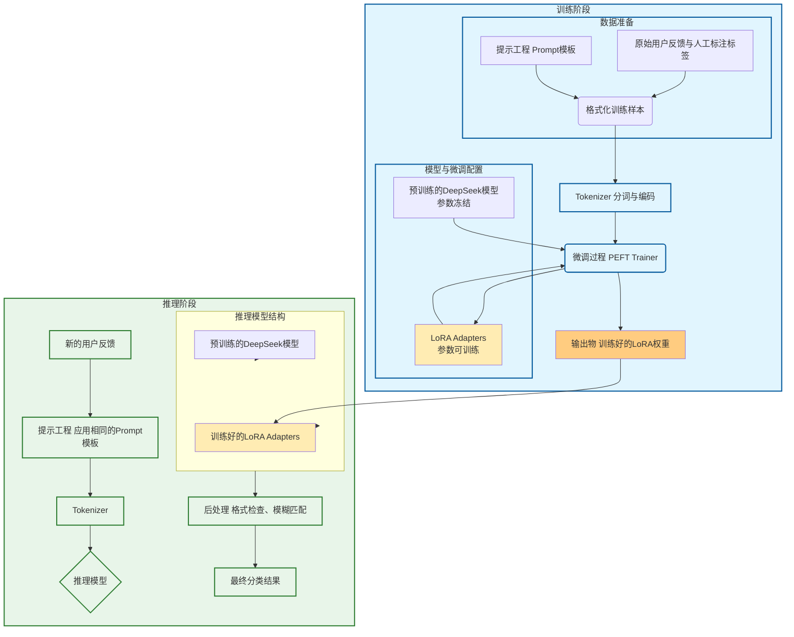
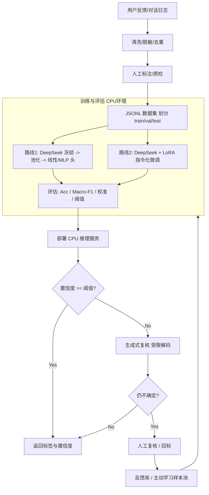

# 方案一

```mermaid
flowchart TD
    subgraph A [训练阶段]
        direction TB
        subgraph A1 [数据准备]
            A1_1[原始用户反馈与人工标注标签]
            A1_2[提示工程 Prompt模板]
            A1_1 --> A1_3(格式化训练样本)
            A1_2 --> A1_3
        end

        A1_3 --> A2[Tokenizer 分词与编码]

        subgraph A3 [模型与微调配置]
            A3_1[预训练的DeepSeek模型<br>参数冻结]
            A3_2[LoRA Adapters<br>参数可训练]
        end

        A2 --> A4(微调过程 PEFT Trainer)
        A3_1 --> A4
        A3_2 --> A4

        A4 --> A3_2
        A4 --> A5[输出物 训练好的LoRA权重]
    end

    subgraph B [推理阶段]
        direction TB
        B1[新的用户反馈] --> B2[提示工程 应用相同的Prompt模板]
        B2 --> B3[Tokenizer]
        B3 --> B4{推理模型}
        
        subgraph B4_sub [推理模型结构]
            B4_1[预训练的DeepSeek模型]
            B4_2[训练好的LoRA Adapters]
        end
        B4_1 --> B4_sub
        B4_2 --> B4_sub

        B4_sub --> B5[后处理 格式检查、模糊匹配]
        B5 --> B6[最终分类结果]
    end

    A5 --> B4_2

    classDef train fill:#e1f5fe,stroke:#01579b,stroke-width:2px;
    classDef infer fill:#e8f5e9,stroke:#2e7d32,stroke-width:2px;
    classDef lora fill:#ffecb3;
    classDef output fill:#ffcc80;
    
    class A,A1,A2,A3,A4 train;
    class B,B1,B2,B3,B4,B5,B6 infer;
    class A3_2,B4_2 lora;
    class A5 output;
```

# 方案二

```mermaid
flowchart TD
    A[用户反馈/对话日志] --> B[清洗/脱敏/去重]
    B --> C[人工标注/质检]
    C --> D[JSONL 数据集 划分 train/val/test]
    
    subgraph E[训练与评估 CPU环境]
        D --> F1[路线1: DeepSeek 冻结 -> 池化 -> 线性/MLP 头]
        D --> F2[路线2: DeepSeek + LoRA 指令化微调]
        F1 --> G[评估: Acc / Macro-F1 / 校准 / 阈值]
        F2 --> G
    end

    G --> H[部署 CPU 推理服务]
    H --> I{置信度 >= 阈值?}
    I -- Yes --> J[返回标签与置信度]
    I -- No --> K[生成式复核 受限解码]
    K --> L{仍不确定?}
    L -- Yes --> M[人工复核 / 回标]
    L -- No --> J
    M --> N[反馈库 / 主动学习样本池]
    N --> E
```